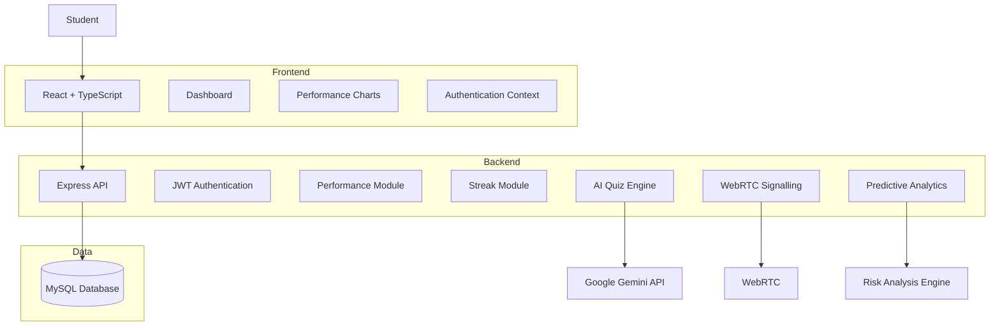
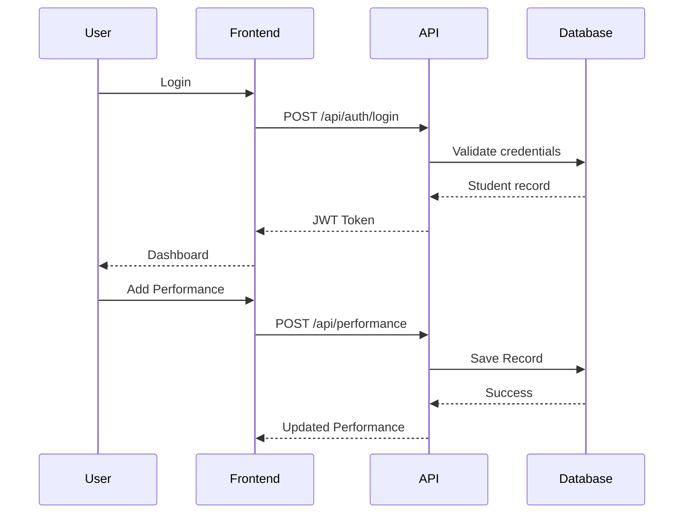
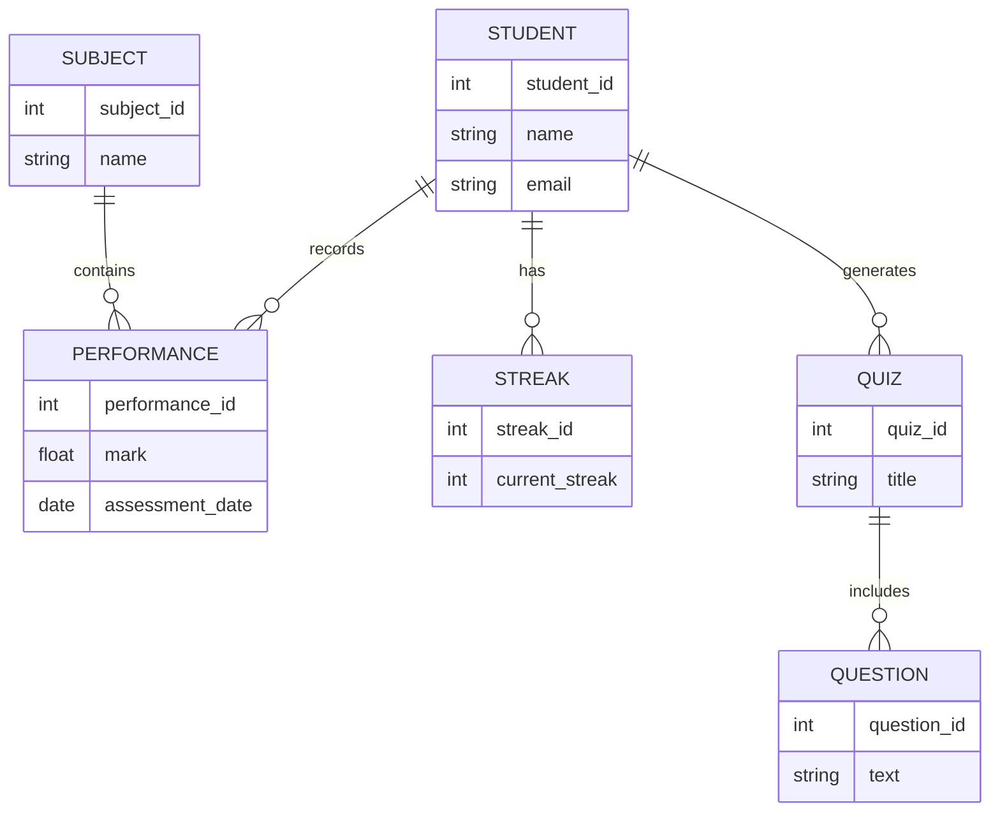
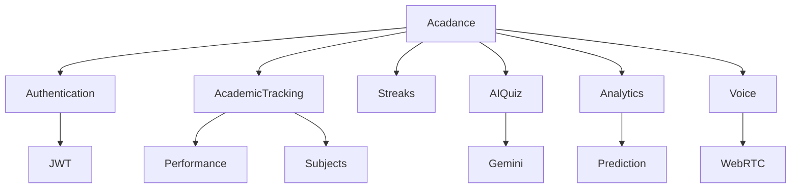

<div align="center">

# Acadance

### Student Academic Insights & Collaborative System


</div>
<br>

A full-stack academic platform that helps students track performance, build consistent study habits, and (in later phases) collaborate through AI-generated quizzes and voice-based study sessions.

Built as a final-year dissertation project for the **BSc in Information Technology (Software Development)** at Richfield Graduate Institute of Technology.

---

## Overview

Acadance addresses a simple problem: students often don't know how they're doing until it's too late to act on it. The platform combines academic tracking, gamified consistency (streaks), and — in upcoming phases — AI-driven insights and peer collaboration into a single tool.

The name reflects the core idea: **academic + cadence** — building a sustainable rhythm of study, not just isolated cramming.

## Features

| Module | Status | Description |
|---|---|---|
| Authentication |  Complete | Secure registration/login with hashed passwords and JWT sessions |
| Academic Tracking |  Complete | Log test/assignment results per subject, view trends on an interactive chart |
| Streaks & Gamification | Complete | Real activity-based streak tracking (not a manual counter) — login, logging results, and future actions all count |
| AI Quiz Generation |  Planned | Auto-generated quizzes from study material with auto-marking |
| Voice Study Sessions | Complete | Real-time collaborative study rooms via WebRTC |
| Predictive Analytics | Planned | At-risk student identification from historical performance data |

## Tech Stack

- **Frontend:** React 18 + TypeScript, Vite, React Router, Axios, Recharts
- **Backend:** Node.js + Express + TypeScript
- **Database:** MySQL
- **Auth:** JWT + bcrypt password hashing

## Project Structure

```
acadance/
├── backend/
│   ├── database/
│   │   ├── schema.sql            # Core tables — run this first
│   │   ├── seed.sql              # Optional sample subjects
│   │   └── phase3_streaks.sql    # Adds daily_activity table for streaks
│   ├── src/
│   │   ├── config/db.ts          # MySQL connection pool
│   │   ├── models/               # Database queries per entity
│   │   ├── controllers/          # Request handlers
│   │   ├── middleware/           # JWT auth guard
│   │   ├── routes/                # /api/auth, /api/students, /api/subjects,
│   │   │                          # /api/performance, /api/streaks
│   │   └── server.ts             # Express entry point
│   └── .env.example              # Copy to .env and fill in your MySQL credentials
│
└── frontend/
    └── src/
        ├── api/client.ts         # Axios instance (auto-attaches JWT)
        ├── context/AuthContext.tsx
        ├── hooks/useStreak.ts
        ├── components/           # Sidebar, ProtectedRoute, BarField
        └── pages/                # Login, Register, Dashboard, Performance, Streak
```

## Getting Started

### Prerequisites
- [Node.js](https://nodejs.org) (LTS recommended)
- MySQL (via [XAMPP](https://www.apachefriends.org/) or standalone)
- Git

### 1. Database setup
Using phpMyAdmin (or the MySQL CLI), run the SQL files in this order:
```
backend/database/schema.sql
backend/database/seed.sql            (optional — sample subjects)
backend/database/phase3_streaks.sql
```

### 2. Backend
```bash
cd backend
cp .env.example .env
```
Edit `.env`:
```
DB_HOST=localhost
DB_PORT=3306
DB_USER=root
DB_PASSWORD=
DB_NAME=saics_db
JWT_SECRET=replace_with_a_long_random_string
JWT_EXPIRES_IN=7d
```
Then:
```bash
npm install
npm run dev
```
Runs on `http://localhost:5000`.

### 3. Frontend
```bash
cd frontend
npm install
npm run dev
```
Runs on `http://localhost:5173` (or the next available port).

Open the frontend URL, register an account, and you're in.

## API Reference

| Method | Endpoint | Description | Auth required |
|---|---|---|---|
| POST | `/api/auth/register` | Create a new student account | No |
| POST | `/api/auth/login` | Log in and receive a JWT | No |
| GET | `/api/students/me` | Get the logged-in student's profile | Yes |
| GET | `/api/subjects` | List all subjects | Yes |
| POST | `/api/subjects` | Create a subject | Yes |
| GET | `/api/performance` | List the student's performance records | Yes |
| POST | `/api/performance` | Add a performance record | Yes |
| PUT | `/api/performance/:id` | Update a performance record | Yes |
| DELETE | `/api/performance/:id` | Delete a performance record | Yes |
| GET | `/api/streaks/me` | Get current streak + last 7 days of activity | Yes |
| POST | `/api/streaks/checkin` | Record today's activity | Yes |

## Design System

The interface is built around the product's own name: a "cadence bar" motif (a rhythm/pulse pattern) that appears both decoratively on auth screens and functionally as the literal streak visualization. Typography pairs a serif display face (Fraunces) with Inter for UI text and IBM Plex Mono for all numeric data, so scores and streak counts read distinctly from prose.

## System Architecture



## Request Flow



## Database Design


## Module Architecture



## Roadmap

This project follows a phased build, matching the dissertation timeline:

- [x] **Phase 1** — Authentication, database schema, dashboard shell
- [x] **Phase 2** — Academic Tracking Module (performance CRUD + trend chart)
- [x] **Phase 3a** — Streaks & Gamification
- [ ] **Phase 3b** — Voice-based Study Sessions (WebRTC)
- [ ] **Phase 4** — AI Quiz Generation Module
- [ ] **Phase 5** — Predictive Analytics (at-risk student identification)

## Author

**Thabang Ashley Phahlamohlaka**
BSc Information Technology (Software Development), Richfield Graduate Institute of Technology
Supervisor: Mr. Silas Tops

## License

This project is submitted as part of an academic dissertation and is not licensed for commercial use.

