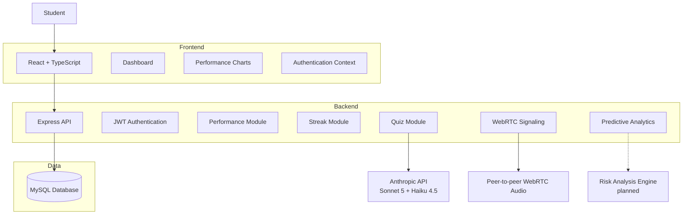
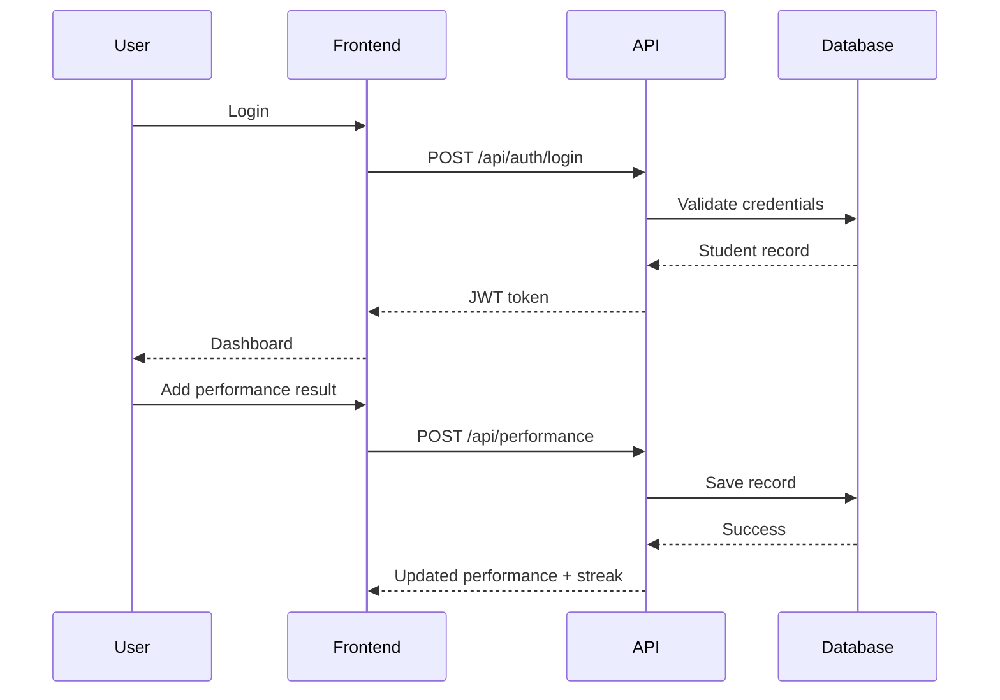
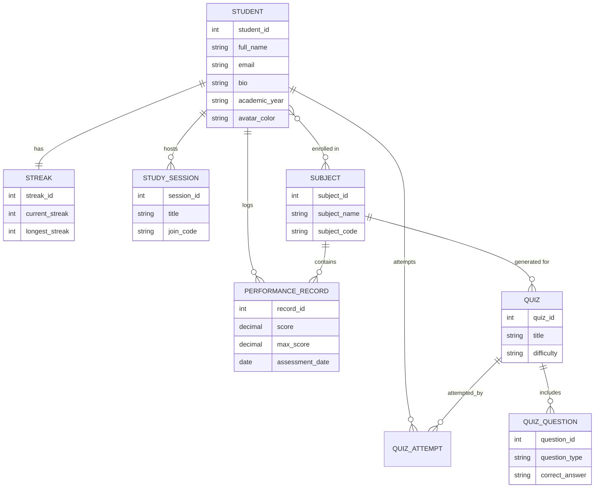
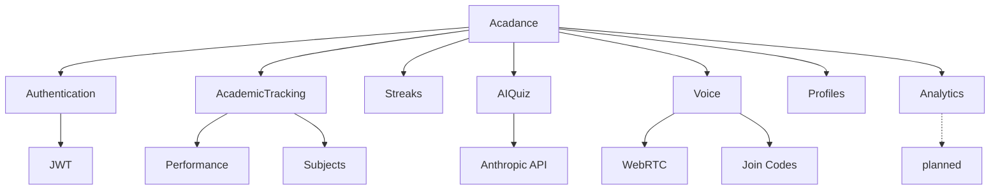

<div align="center">

# Acadance

### Student Academic Insights & Collaborative System


</div>
<br>

A full-stack academic platform that helps students track performance, build consistent study habits, and collaborate through AI-generated quizzes and voice-based study sessions.

Built as a final-year dissertation project for the **BSc in Information Technology (Software Development)** at Richfield Graduate Institute of Technology.

---

## Overview

Acadance addresses a simple problem: students often don't know how they're doing until it's too late to act on it. The platform combines academic tracking, gamified consistency (streaks), AI-driven quiz generation, and real-time peer collaboration into a single tool.

The name reflects the core idea: **academic + cadence** — building a sustainable rhythm of study, not just isolated cramming.

## Features

| Module | Status | Description |
|---|---|---|
| Authentication | Complete | Secure registration/login with hashed passwords and JWT sessions |
| Academic Tracking |  Complete | Log test/assignment results per subject, view trends on an interactive chart |
| Streaks & Gamification |  Complete | Real activity-based streak tracking (not a manual counter) — login, logging results, quizzes, and study sessions all count |
| Voice Study Sessions |  Complete | Real-time collaborative study rooms via WebRTC, joinable by link or a shareable 6-character code |
| AI Quiz Generation |  Complete | Quizzes generated from pasted study material via the Anthropic API, with AI-assisted grading of open-ended answers |
| Student Profiles | Complete | Editable bio, academic year, avatar color, and subject enrollment |
| Notifications & Recommendations |  Complete | Rules-based alerts for low scores, streak-reset reminders, and quiz-retry suggestions — triggered by real activity, not manually created |
| Predictive Analytics |  Planned | At-risk student identification from historical performance data |

## Tech Stack

- **Frontend:** React 18 + TypeScript, Vite, React Router, Axios, Recharts, Socket.IO client
- **Backend:** Node.js + Express + TypeScript, Socket.IO (WebRTC signaling)
- **Database:** MySQL
- **Auth:** JWT + bcrypt password hashing
- **AI:** Anthropic API — Claude Sonnet 5 for quiz generation, Claude Haiku 4.5 for grading open-ended answers

## Project Structure

```
acadance/
├── backend/
│   ├── database/
│   │   ├── schema.sql                # Core tables — run this first
│   │   ├── seed.sql                  # Optional sample subjects
│   │   ├── phase3_streaks.sql        # Adds daily_activity table for streaks
│   │   ├── phase_profile.sql         # Adds bio/academic_year/avatar_color to students
│   │   ├── phase_join_codes.sql      # Adds join_code to study_sessions
│   │   └── phase_avatar_upload.sql   # Adds avatar_url to students
│   ├── src/
│   │   ├── config/db.ts              # MySQL connection pool
│   │   ├── models/                   # Database queries per entity
│   │   ├── controllers/              # Request handlers
│   │   ├── middleware/               # JWT auth guard
│   │   ├── services/aiService.ts     # Anthropic API integration
│   │   ├── sockets/signaling.ts      # WebRTC signaling server
│   │   ├── routes/                   # auth, students, subjects, performance,
│   │   │                             # streaks, study-sessions, quizzes
│   │   └── server.ts                 # Express + HTTP + Socket.IO entry point
│   └── .env.example                  # Copy to .env and fill in your credentials
│
└── frontend/
    └── src/
        ├── api/client.ts             # Axios instance (auto-attaches JWT)
        ├── context/AuthContext.tsx
        ├── hooks/useStreak.ts
        ├── components/               # Sidebar, ProtectedRoute, BarField
        └── pages/                    # Login, Register, Dashboard, Performance,
                                       # Streak, StudySessions, StudyRoom,
                                       # Quizzes, TakeQuiz, Profile
```

## Getting Started

### Prerequisites
- [Node.js](https://nodejs.org) (LTS recommended)
- MySQL (via [XAMPP](https://www.apachefriends.org/) or standalone)
- Git
- An [Anthropic API key](https://console.anthropic.com) (only needed for the Quiz module)

### 1. Database setup
Using phpMyAdmin (or the MySQL CLI), run the SQL files in this order:
```
backend/database/schema.sql
backend/database/seed.sql              (optional — sample subjects)
backend/database/phase3_streaks.sql
backend/database/phase_profile.sql
backend/database/phase_join_codes.sql
backend/database/phase_avatar_upload.sql
```

### 2. Backend
```bash
cd backend
cp .env.example .env
```
Edit `.env`:
```
DB_HOST=localhost
DB_PORT=3306
DB_USER=root
DB_PASSWORD=
DB_NAME=saics_db
JWT_SECRET=replace_with_a_long_random_string
JWT_EXPIRES_IN=7d
ANTHROPIC_API_KEY=your_anthropic_api_key
```
Then:
```bash
npm install
npm run dev
```
Runs on `http://localhost:5000`.

### 3. Frontend
```bash
cd frontend
npm install
npm run dev
```
Runs on `http://localhost:5173` (or the next available port).

Open the frontend URL, register an account, and you're in.

## Testing

```bash
cd backend
npm test
```
48 automated tests covering validation logic, the streak calculation rule, controller behavior, and the notification/recommendation triggers — all with mocked models and a mocked AI service, so no live database or API credits are needed to run them. See [TESTING.md](./TESTING.md) for full coverage details and the manual test checklist for the AI quiz and voice session features.

## API Reference

| Method | Endpoint | Description | Auth required |
|---|---|---|---|
| POST | `/api/auth/register` | Create a new student account | No |
| POST | `/api/auth/login` | Log in and receive a JWT | No |
| GET | `/api/students/me` | Get the logged-in student's profile | Yes |
| PUT | `/api/students/me` | Update profile (name, bio, academic year, avatar color) | Yes |
| POST | `/api/students/me/subjects` | Enroll in a subject | Yes |
| DELETE | `/api/students/me/subjects/:subjectId` | Unenroll from a subject | Yes |
| POST | `/api/students/me/avatar` | Upload a profile photo (multipart/form-data) | Yes |
| DELETE | `/api/students/me/avatar` | Remove uploaded photo, revert to color avatar | Yes |
| GET | `/api/notifications` | List recent notifications + unread count | Yes |
| POST | `/api/notifications/:id/read` | Mark one notification as read | Yes |
| POST | `/api/notifications/read-all` | Mark all notifications as read | Yes |
| GET | `/api/subjects` | List all subjects | Yes |
| POST | `/api/subjects` | Create a subject | Yes |
| GET | `/api/performance` | List the student's performance records | Yes |
| POST | `/api/performance` | Add a performance record | Yes |
| PUT | `/api/performance/:id` | Update a performance record | Yes |
| DELETE | `/api/performance/:id` | Delete a performance record | Yes |
| GET | `/api/streaks/me` | Get current streak + last 7 days of activity | Yes |
| POST | `/api/streaks/checkin` | Record today's activity | Yes |
| GET | `/api/study-sessions` | List active voice study sessions | Yes |
| POST | `/api/study-sessions` | Create a study session (returns a join code) | Yes |
| POST | `/api/study-sessions/join-by-code` | Join a session using its 6-character code | Yes |
| POST | `/api/study-sessions/:id/join` | Join a study session by ID | Yes |
| POST | `/api/study-sessions/:id/leave` | Leave a study session | Yes |
| POST | `/api/study-sessions/:id/end` | End a session (host only) | Yes |
| POST | `/api/quizzes/generate` | Generate an AI quiz from pasted study material | Yes |
| GET | `/api/quizzes` | List all available quizzes | Yes |
| GET | `/api/quizzes/:id` | Get a quiz's questions (answers withheld) | Yes |
| POST | `/api/quizzes/:id/submit` | Submit answers for AI-assisted grading | Yes |
| GET | `/api/quizzes/history/me` | View your past quiz attempts | Yes |

## Design System

The interface is built around the product's own name: a "cadence bar" motif (a rhythm/pulse pattern) that appears both decoratively on auth screens and functionally as the literal streak visualization. Typography pairs a serif display face (Fraunces) with Inter for UI text and IBM Plex Mono for all numeric data, so scores and streak counts read distinctly from prose.

## System Architecture



## Request Flow



## Database Design



## Module Architecture



## Roadmap

This project follows a phased build, matching the dissertation timeline:

- [x] **Phase 1** — Authentication, database schema, dashboard shell
- [x] **Phase 2** — Academic Tracking Module (performance CRUD + trend chart)
- [x] **Phase 3a** — Streaks & Gamification
- [x] **Phase 3b** — Voice-based Study Sessions (WebRTC)
- [x] **Phase 4** — AI Quiz Generation Module
- [ ] **Phase 5** — Predictive Analytics (at-risk student identification)

### Improvements & To-Do
- [x] Student profile setup (edit name, bio, academic year, avatar color, and subject enrollment)
- [x] Human-friendly session IDs/codes for study sessions
- [x] Formal testing pass — see [TESTING.md](./TESTING.md)

## Known Limitations

- **Voice sessions use a full-mesh WebRTC topology** — every participant connects directly to every other participant. This works well for small groups (2–5 people) but doesn't scale to large rooms; a production version would use a media server (SFU) instead.
- **AI quiz grading costs API credits per open-ended answer graded** — multiple-choice questions are graded for free with simple string comparison, but short-answer grading calls the Anthropic API.

## Author

**Thabang Ashley Phahlamohlaka**
BSc Information Technology (Software Development), Richfield Graduate Institute of Technology
Supervisor: Mr. Silas Tops

## License

This project is submitted as part of an academic dissertation and is not licensed for commercial use.
